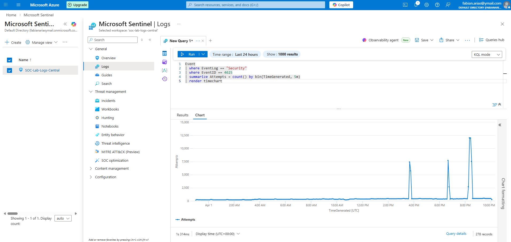
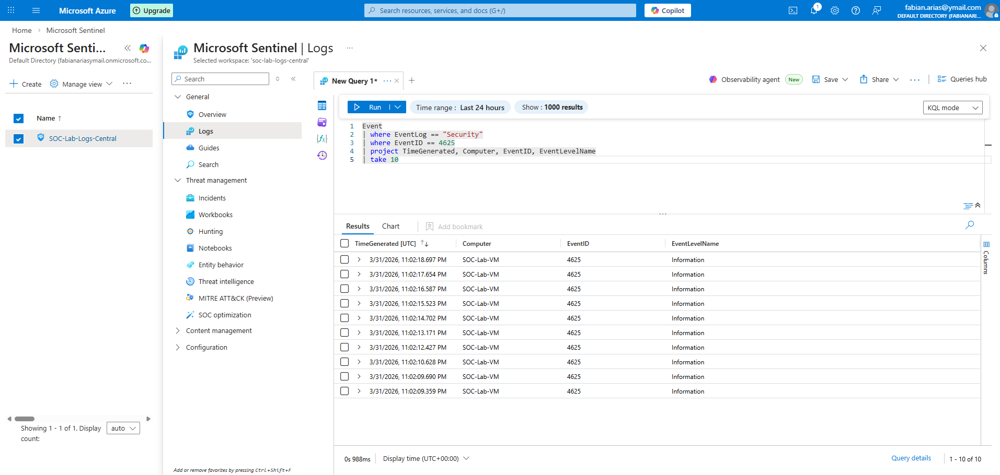
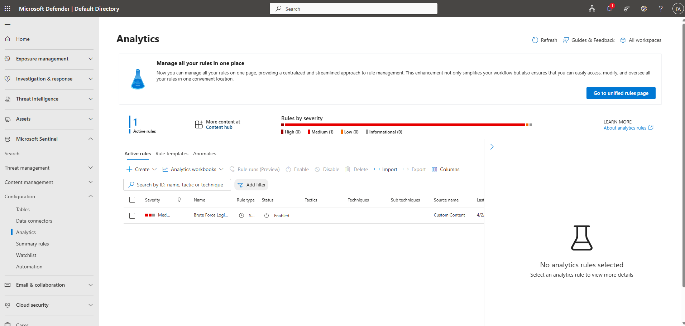
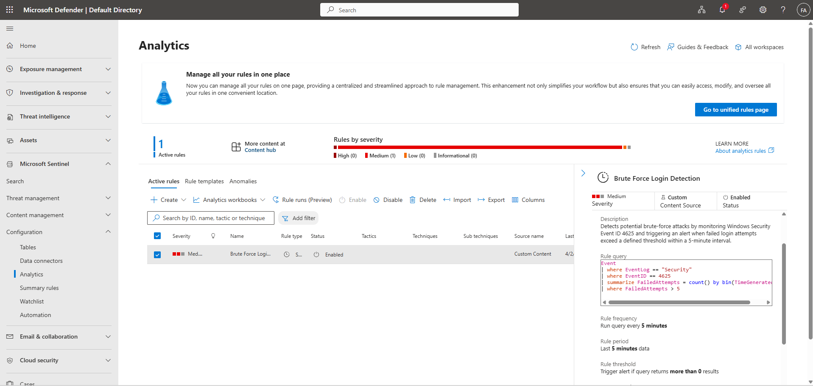

# Azure SOC Lab – Brute Force Detection

## 📌 Overview
This project demonstrates how to build a cloud-based Security Operations Center (SOC) lab in Azure using Microsoft Sentinel. The lab focuses on detecting brute-force login attempts using Windows Security Event Logs and KQL queries.

---

## 🛠️ Technologies Used
- Microsoft Azure
- Microsoft Sentinel (SIEM)
- Log Analytics Workspace
- Windows Virtual Machine
- Kusto Query Language (KQL)

---

## 🔍 Detection Use Cases

| # | Query File | Event ID | Description |
|---|---|---|---|
| 1 | [`01_brute_force_detection.kql`](queries/01_brute_force_detection.kql) | 4625 | Detects repeated failed logins in 5-minute windows |
| 2 | [`02_brute_force_with_source_ip.kql`](queries/02_brute_force_with_source_ip.kql) | 4625 | Enriches failed logins with source IP and targeted accounts |
| 3 | [`03_successful_login_after_failures.kql`](queries/03_successful_login_after_failures.kql) | 4625 + 4624 | Identifies successful logins following repeated failures — high-confidence brute force indicator |
| 4 | [`04_account_lockout_detection.kql`](queries/04_account_lockout_detection.kql) | 4740 | Surfaces locked-out accounts and the machines triggering lockouts |

---

## 🧪 Core KQL Query

```kql
// Brute Force Detection – 5+ failures in a 5-minute window
Event
| where EventLog == "Security"
| where EventID == 4625
| summarize FailedAttempts = count() by bin(TimeGenerated, 5m)
| where FailedAttempts > 5
| order by FailedAttempts desc
```

> See the [`queries/`](queries/) folder for all detection queries with inline documentation.

---

## 📸 Lab Screenshots

### Log Data





---

## 🎯 Outcome
- Ingested Windows Security logs into Microsoft Sentinel via Log Analytics Workspace
- Built KQL queries to detect failed login attempts, enrich with source IP, and correlate with successful logins
- Created an analytics rule for automated brute-force alerting
- Visualized attack patterns using timecharts
- Identified the full attack chain: failed attempts → account lockout → potential successful compromise
